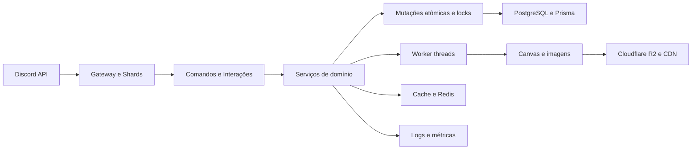

  

  <h1>Sophie Chan</h1>
  
<strong>Um projeto de economia para Discord construído como produto, não apenas como uma coleção de comandos.</strong>

  
  

> [!NOTE]
> A Sophie Chan é um projeto proprietário e de código fechado. Este repositório apresenta o produto, os sistemas desenvolvidos e as decisões de engenharia, sem disponibilizar o código-fonte.

## Navegação

| | |
| --- | --- |
| [O projeto](#o-projeto) | [Stack](#stack) |
| [O problema que eu quis resolver](#o-problema-que-eu-quis-resolver) | [Sistemas de destaque](#sistemas-de-destaque) |
| [Arquitetura](#arquitetura) | [Decisões de engenharia](#decisões-de-engenharia) |
| [Experiência dentro do Discord](#experiência-dentro-do-discord) | [Aprendizados](#o-que-este-projeto-me-permitiu-desenvolver) |
| [Status](#status) | [Conheça a Sophie](#conheça-a-sophie) |

## O projeto

A Sophie Chan nasceu como um bot de economia e evoluiu para um projeto focado em progressão, retenção e sistemas que conversam entre si. A proposta é evitar o ciclo comum de executar um comando, receber moedas e repetir a mesma ação alguns minutos depois.

Cada parte da economia deixa consequências em outras áreas. Empresas geram receita, contratos, reputação e risco fiscal. Roubos podem deixar evidências. Dinheiro sujo exige decisões para voltar à economia. Ações ilegais podem resultar em investigação policial ou auditoria da Receita Federal.

Este repositório representa meu trabalho na criação do produto, da experiência dentro do Discord e da estrutura necessária para manter uma economia persistente funcionando.

<table align="center">
  <tr>
    <td align="center" width="50%">
       
      Identidade visual criada para acompanhar a experiência do produto.
    </td>
    <td align="center" width="50%">
       
      Um projeto desenvolvido e mantido de forma independente.
    </td>
  </tr>
</table>

<h2 id="stack">Stack</h2>

<table align="center">
  <thead>
    <tr>
      <th align="center" width="180">Camada</th>
      <th align="center" width="560">Tecnologias e responsabilidades</th>
    </tr>
  </thead>
  <tbody>
    <tr><td align="center">Aplicação</td><td>TypeScript, Node.js e Discord.js v14</td></tr>
    <tr><td align="center">Interface</td><td>Slash commands, modais, seletores, botões e Components V2</td></tr>
    <tr><td align="center">Dados</td><td>PostgreSQL, Prisma Client, repositórios e armazenamento estruturado</td></tr>
    <tr><td align="center">Concorrência</td><td>Operações atômicas, locks por usuário e modo single-writer</td></tr>
    <tr><td align="center">Escala</td><td>ShardingManager, serviços de runtime e tarefas em background</td></tr>
    <tr><td align="center">Processamento</td><td>Worker threads para canvas, ranking, pesca, fazenda e perfil</td></tr>
    <tr><td align="center">Performance</td><td>Cache em memória, Redis, deduplicação de tarefas e prewarm</td></tr>
    <tr><td align="center">Observabilidade</td><td>Winston, métricas de workers, tempo de resposta e logs por categoria</td></tr>
    <tr><td align="center">Assets</td><td>Cloudflare R2 servido por CDN próprio</td></tr>
  </tbody>
</table>

## O problema que eu quis resolver

Bots de economia costumam perder graça quando todos os comandos seguem a mesma fórmula. A Sophie foi desenhada para transformar saldo em decisões:

* Dinheiro pode ser investido, perdido, lavado, tributado ou reinvestido.
* Empresas possuem estrutura e não funcionam apenas como renda passiva.
* Atividades de risco deixam rastros que podem reaparecer depois.
* O jogador sozinho ainda encontra decisões, minigames e progressão.
* A interface precisa continuar clara mesmo quando o sistema por trás dela é complexo.

Essa escolha mudou a forma como os recursos foram implementados. Em vez de comandos independentes, o projeto passou a trabalhar com eventos econômicos, históricos, riscos, cooldowns, reputação e consequências persistentes.

## Sistemas de destaque

<strong>Economia persistente</strong>

Perfis, saldos, bancos, inventários, cooldowns, progressão e movimentações permanecem salvos no PostgreSQL. Alterações sensíveis utilizam mutações atômicas e locks para reduzir duplicações e conflitos durante operações concorrentes.

<strong>Empresas com progressão própria</strong>

Empresas possuem setores, funcionários, caixa, reserva, reputação, contratos, operações, melhorias e valor de mercado. O crescimento depende das decisões do jogador e não apenas do tempo decorrido.

Contratos rápidos oferecem uma rota ativa para levantar capital. Funcionários e expansões alteram a capacidade operacional, o lucro por hora e o valuation. Operações ilegais podem melhorar resultados no curto prazo, mas aumentam o risco fiscal.

<strong>Governo e investigações</strong>

O sistema governamental conecta atividades econômicas que antes seriam isoladas. Ele administra impostos, patrimônio, multas, Tesouro Nacional, Polícia Civil e Receita Federal.

Investigações consideram eventos reais da conta, como roubos recentes, dinheiro sujo, movimentações empresariais, sonegação e reincidência. O jogador responde etapas interativas e pode ter valores apreendidos, empresas bloqueadas ou sofrer outras penalidades.

<strong>Roubos e lavagem de dinheiro</strong>

Roubos foram estruturados como experiências interativas com equipe, risco, fases e consequências. O sucesso não encerra necessariamente o evento: evidências podem abrir uma janela de investigação durante o cooldown.

A lavagem de dinheiro possui rotas próprias, diálogos e risco de traição. Empresas também podem ser utilizadas como parte dessa economia paralela.

<strong>Perfis renderizados</strong>

O comando de perfil gera cartões personalizados com avatar, display name do servidor, Premium, saldo, nível, XP, reputação, biografia, skins e insignias.

A renderização acontece em worker threads para não bloquear o processamento dos comandos. Fontes e imagens são empacotadas com o projeto, enquanto resultados e assets reutilizados passam por cache.

<strong>Recompensas e retenção</strong>

O projeto possui recompensas diárias, streaks, caixas, drops raros, missões e progressão. Os painéis fixos utilizam IDs persistentes, então continuam funcionais após reinicializações do bot.

As tabelas de drop incluem recompensas comuns e resultados realmente raros, como Premium temporário, sem transformar o sistema em uma fonte descontrolada de dinheiro.

## Arquitetura

A aplicação mantém as regras principais em serviços de domínio. Comandos cuidam da interação com o usuário, enquanto persistência, cálculos econômicos, investigações e renderizações permanecem separados.

Tarefas pesadas de canvas são enviadas para workers. Operações econômicas críticas passam por locks. Rotinas automáticas são executadas por uma shard autorizada para evitar cobranças ou atualizações duplicadas.

## Decisões de engenharia

### Sincronização inteligente de comandos

O bot calcula alterações antes de sincronizar comandos com o Discord. Quando não existe diferença, nenhuma atualização é disparada. Isso reduz chamadas desnecessárias e ajuda a evitar novos períodos de rate limit.

### Persistência além do processo

Painéis interativos não dependem somente de collectors temporários. Ações que precisam sobreviver a reinicializações utilizam identificadores globais e estado persistido.

### Economia protegida contra duplicações

Compras, recompensas e outras mutações críticas utilizam locks e rotinas atômicas. O objetivo é impedir que cliques simultâneos ou processos concorrentes gerem saldo ou itens duplicados.

### Renderização fora da thread principal

Canvas pode consumir CPU e prejudicar o tempo de resposta dos comandos. Por isso, imagens de perfil, ranking e atividades são renderizadas em workers, com cache e reaproveitamento de assets.

### Observabilidade desde o Discord

O projeto registra tempos de dispatch, Discord API, execução interna, banco e workers. Logs separados ajudam a identificar falhas de conexão, rate limits, lentidão e comportamento das shards.

## Experiência dentro do Discord

A interface utiliza os próprios recursos do Discord como parte do produto. Botões, modais e seletores não são tratados apenas como atalhos, mas como elementos de navegação para sistemas maiores.

| Categoria | Exemplos |
| --- | --- |
| Economia | `/trabalhar`, `/empresa`, `/banco`, `/bolsa`, `/mercado`, `/loja` |
| Progressão | `/perfil`, `/ranking`, `/missoes`, `/daily`, `/semanal`, `/caixas` |
| Atividades | `/pesca`, `/minerar`, `/fazenda`, `/roubo`, `/lavar` |
| Social | `/ship`, `/abraco` e interações temáticas |
| Apostas | `/blackjack`, `/poker`, `/mines`, `/aviator`, `/caraoucoroa` |
| Administração | Moderação, autorole, anúncios e painéis configuráveis |

  

## O que este projeto me permitiu desenvolver

* Modelagem de uma economia com múltiplos sistemas dependentes.
* Concorrência, persistência e proteção contra duplicações.
* Interfaces interativas dentro das limitações do Discord.
* Separação entre comandos, serviços, persistência e processamento pesado.
* Monitoramento de performance e investigação de problemas em produção.
* Evolução contínua de um produto a partir de testes e feedbacks reais.

O maior desafio não foi criar muitos comandos. Foi fazer com que eles parecessem partes do mesmo mundo, compartilhassem regras e continuassem confiáveis conforme o projeto crescia.

## Status

A Sophie continua em desenvolvimento ativo. Sistemas existentes recebem ajustes de economia, melhorias de interface e novas integrações antes da inclusão de novas rotas de progressão.

O código-fonte é privado. Este README funciona como apresentação pública do projeto, registro das decisões tomadas e case do trabalho realizado.

## Conheça a Sophie

<table align="center">
  <tr>
    <td align="center" width="180">
      
    </td>
    <td>
      <strong>O projeto pode ser conhecido diretamente pelo Discord.</strong>  
      Adicione a Sophie ao seu servidor para explorar os sistemas ou entre na comunidade para acompanhar o desenvolvimento.
    </td>
  </tr>
</table>

  <a href="https://discord.com/oauth2/authorize?client_id=1438639133437198390"><strong>Adicionar a Sophie Chan</strong></a>
  &nbsp;&nbsp; | &nbsp;&nbsp;
  <a href="https://discord.gg/9h8AMGb6NC"><strong>Entrar na comunidade</strong></a>

    

  
